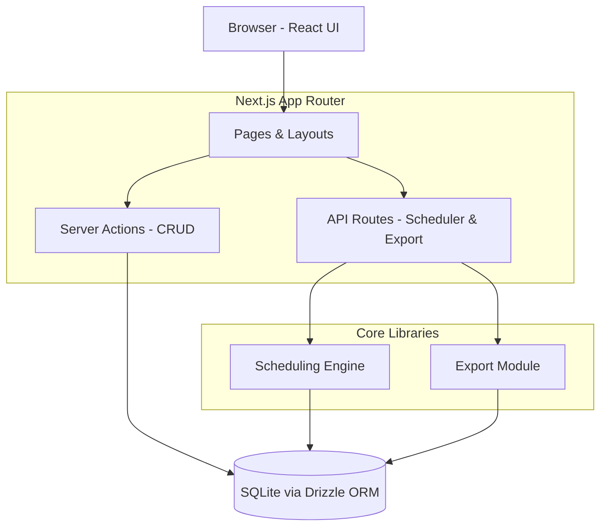
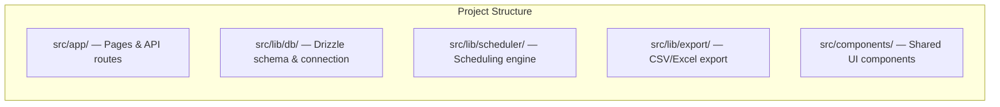
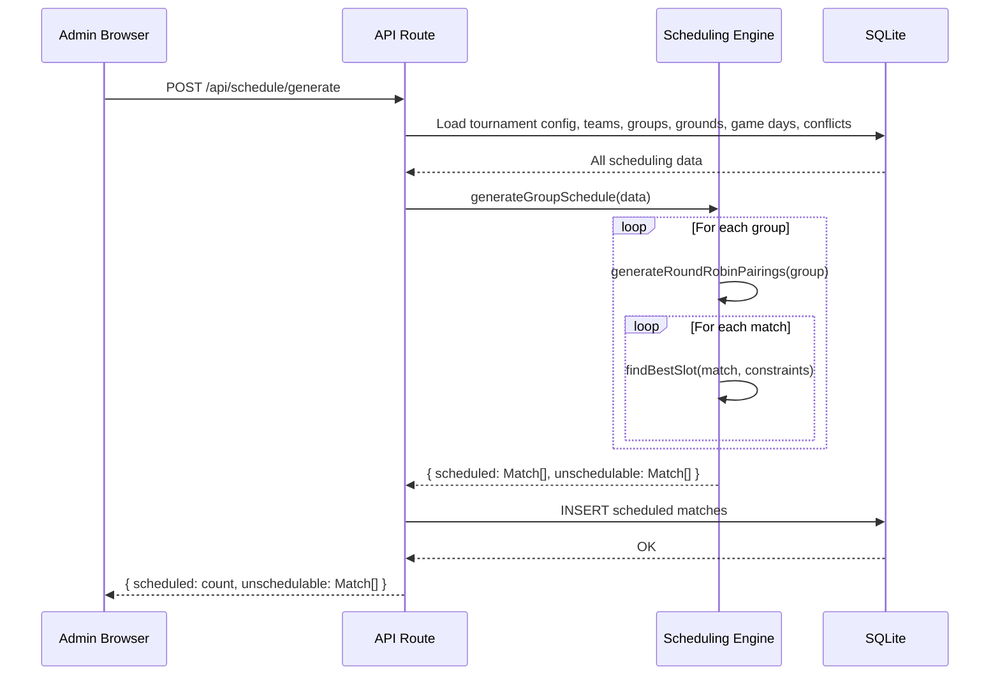
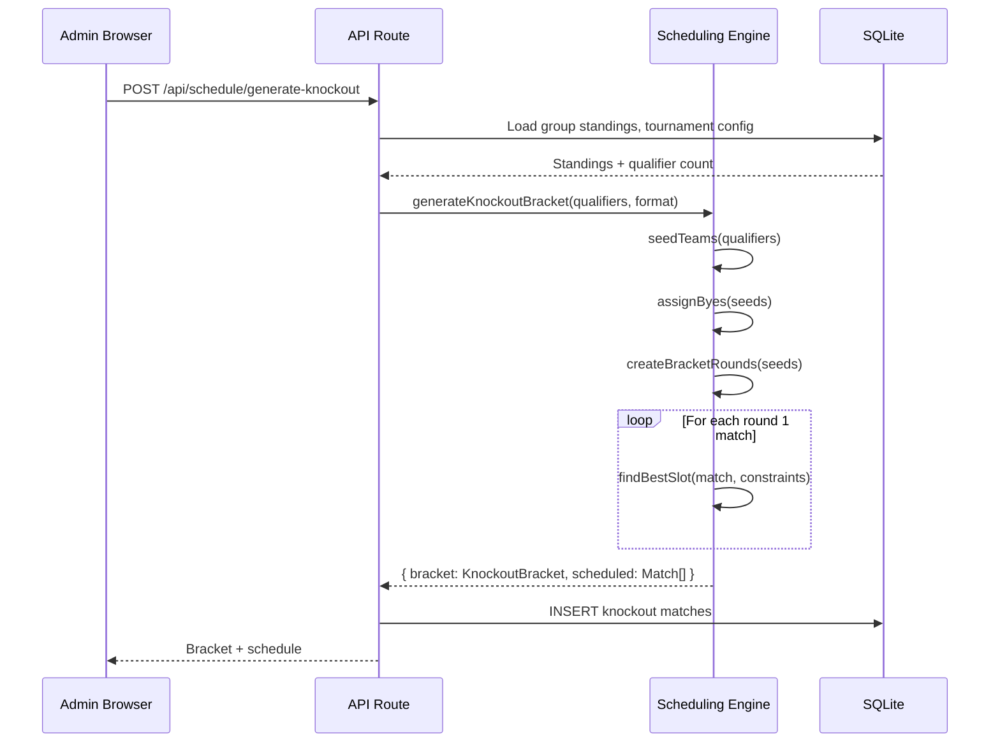
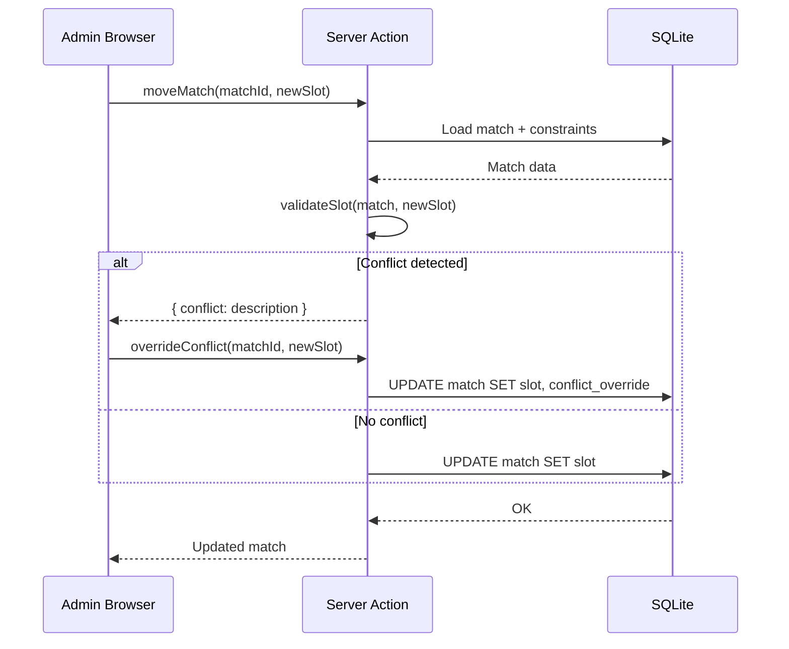

# Design Document: Cricket Tournament Scheduler

## Overview

A full-stack web application for managing and scheduling a multi-format cricket tournament. The system handles two cricket formats (leather ball and tape ball) across four division tiers, with configurable group structures, round-robin group stages, and single-elimination knockout brackets.

The scheduling engine is the core of the system — a constraint-based solver that assigns matches to time slots while respecting format-ground mappings, team conflicts (shared players across formats), umpire availability and balance, and even distribution of matches across the season. Administrators can override conflicts per match, lock matches in place, and re-run the scheduler on remaining unscheduled matches.

The app is a single-user admin tool with no authentication. It provides a calendar-based schedule view, group standings with promotion/relegation zones, a visual knockout bracket, and CSV/Excel export.

## Architecture





## Sequence Diagrams

### Schedule Generation Flow



### Knockout Generation Flow



### Match Override Flow



## Components and Interfaces

### Component 1: Scheduling Engine (`src/lib/scheduler/`)

**Purpose**: Pure-function constraint solver that generates match schedules for group and knockout stages.

```typescript
interface SchedulingEngine {
  generateGroupSchedule(input: ScheduleInput): ScheduleResult
  generateKnockoutBracket(qualifiers: QualifiedTeam[], format: Format, slots: TimeSlot[]): KnockoutResult
  reschedule(input: RescheduleInput): ScheduleResult
}
```

**Responsibilities**:
- Generate all round-robin pairings for each group
- Assign matches to time slots respecting all constraints
- Distribute umpire assignments evenly across teams
- Spread each team's matches evenly across the season
- Report unschedulable matches with reasons
- Support re-scheduling of non-locked, non-played matches

### Component 2: Database Layer (`src/lib/db/`)

**Purpose**: Drizzle ORM schema definitions, connection management, and typed query helpers.

```typescript
interface DatabaseLayer {
  // Schema exports for all tables
  tournaments: Table
  divisions: Table
  groups: Table
  teams: Table
  teamConflicts: Table
  grounds: Table
  gameDays: Table
  timeSlots: Table
  matches: Table
}
```

**Responsibilities**:
- Define SQLite schema with Drizzle ORM
- Provide typed query/mutation helpers
- Handle migrations

### Component 3: Export Module (`src/lib/export/`)

**Purpose**: Generate CSV and Excel files from schedule data.

```typescript
interface ExportModule {
  exportToCSV(matches: MatchView[], filters?: ScheduleFilters): string
  exportToExcel(matches: MatchView[], filters?: ScheduleFilters): Buffer
}
```

**Responsibilities**:
- Format match data for export (date, time, ground, teams, umpires, status)
- Support filtered exports
- Generate Excel via SheetJS, CSV as fallback

### Component 4: Admin Pages (`src/app/`)

**Purpose**: Next.js App Router pages for all CRUD operations and schedule management.

**Responsibilities**:
- Tournament, division, team, conflict, ground, game day CRUD via Server Actions
- Schedule generator trigger and progress display
- Calendar view with format/division/group/team filters
- Match detail editing, conflict override, lock toggle, result entry
- Group standings tables with promotion/relegation zones
- Visual knockout bracket
- Export trigger (CSV/Excel download)

## Data Models

### Drizzle ORM Schema

```typescript
// src/lib/db/schema.ts

import { sqliteTable, text, integer, real } from "drizzle-orm/sqlite-core"

export const tournaments = sqliteTable("tournaments", {
  id: integer("id").primaryKey({ autoIncrement: true }),
  name: text("name").notNull(),
  season: text("season").notNull(),
  leatherGameDurationMin: integer("leather_game_duration_min").notNull().default(240),
  tapeBallGameDurationMin: integer("tape_ball_game_duration_min").notNull().default(225),
  leatherQualifierCount: integer("leather_qualifier_count").notNull().default(8),
  tapeBallQualifierCount: integer("tape_ball_qualifier_count").notNull().default(6),
})

export const divisions = sqliteTable("divisions", {
  id: integer("id").primaryKey({ autoIncrement: true }),
  tournamentId: integer("tournament_id").notNull().references(() => tournaments.id),
  tier: integer("tier").notNull(), // 1-4
  name: text("name").notNull(),
})

export const groups = sqliteTable("groups", {
  id: integer("id").primaryKey({ autoIncrement: true }),
  divisionId: integer("division_id").notNull().references(() => divisions.id),
  format: text("format", { enum: ["leather", "tape_ball"] }).notNull(),
  name: text("name").notNull(),
})

export const teams = sqliteTable("teams", {
  id: integer("id").primaryKey({ autoIncrement: true }),
  groupId: integer("group_id").notNull().references(() => groups.id),
  name: text("name").notNull(),
})

export const teamConflicts = sqliteTable("team_conflicts", {
  id: integer("id").primaryKey({ autoIncrement: true }),
  teamAId: integer("team_a_id").notNull().references(() => teams.id),
  teamBId: integer("team_b_id").notNull().references(() => teams.id),
  level: text("level", { enum: ["same_slot", "same_day"] }).notNull(),
})

export const grounds = sqliteTable("grounds", {
  id: integer("id").primaryKey({ autoIncrement: true }),
  tournamentId: integer("tournament_id").notNull().references(() => tournaments.id),
  name: text("name").notNull(),
  format: text("format", { enum: ["leather", "tape_ball"] }).notNull(),
})

export const gameDays = sqliteTable("game_days", {
  id: integer("id").primaryKey({ autoIncrement: true }),
  tournamentId: integer("tournament_id").notNull().references(() => tournaments.id),
  date: text("date").notNull(), // ISO date string (YYYY-MM-DD)
})

export const timeSlots = sqliteTable("time_slots", {
  id: integer("id").primaryKey({ autoIncrement: true }),
  gameDayId: integer("game_day_id").notNull().references(() => gameDays.id),
  groundId: integer("ground_id").notNull().references(() => grounds.id),
  startTime: text("start_time").notNull(), // HH:MM
  slotIndex: integer("slot_index").notNull(), // 0, 1, or 2
})

export const matches = sqliteTable("matches", {
  id: integer("id").primaryKey({ autoIncrement: true }),
  groupId: integer("group_id").references(() => groups.id), // null for knockout
  teamAId: integer("team_a_id").notNull().references(() => teams.id),
  teamBId: integer("team_b_id").notNull().references(() => teams.id),
  timeSlotId: integer("time_slot_id").references(() => timeSlots.id), // null if unscheduled
  stage: text("stage", { enum: ["group", "knockout"] }).notNull(),
  knockoutRound: integer("knockout_round"), // null for group stage
  status: text("status", { enum: ["scheduled", "played", "cancelled"] }).notNull().default("scheduled"),
  teamAScore: integer("team_a_score"),
  teamBScore: integer("team_b_score"),
  winnerId: integer("winner_id").references(() => teams.id),
  umpireTeam1Id: integer("umpire_team_1_id").references(() => teams.id),
  umpireTeam2Id: integer("umpire_team_2_id").references(() => teams.id), // knockout only
  isLocked: integer("is_locked", { mode: "boolean" }).notNull().default(false),
  conflictOverride: text("conflict_override"), // JSON string describing override reason
})
```

**Validation Rules**:
- `divisions.tier` must be 1-4
- `teamConflicts` pairs must reference teams in different groups (cross-format conflicts)
- `timeSlots.slotIndex` must be 0, 1, or 2
- `matches.umpireTeam2Id` only set when `stage === "knockout"`
- `matches.teamAId !== matches.teamBId`
- A team cannot appear in two matches in the same time slot
- `teamConflicts.teamAId < teamConflicts.teamBId` (canonical ordering to prevent duplicates)

## Algorithmic Pseudocode

### Algorithm 1: Round-Robin Pairing Generation

```typescript
function generateRoundRobinPairings(teams: Team[]): [Team, Team][] {
  const pairings: [Team, Team][] = []
  for (let i = 0; i < teams.length; i++) {
    for (let j = i + 1; j < teams.length; j++) {
      pairings.push([teams[i], teams[j]])
    }
  }
  return pairings
}
```

**Preconditions:**
- `teams.length >= 2`
- All teams belong to the same group

**Postconditions:**
- Returns exactly `N*(N-1)/2` pairings where N = teams.length
- Every pair of teams appears exactly once
- No team is paired with itself

**Loop Invariants:**
- After processing index `i`, all pairings involving `teams[0..i]` with higher-indexed teams are included

### Algorithm 2: Constraint-Based Slot Assignment

```typescript
interface ScheduleInput {
  matches: UnscheduledMatch[]       // all matches needing slots
  slots: TimeSlot[]                 // all available time slots
  conflicts: TeamConflict[]         // cross-format conflict pairs
  existingSchedule: Match[]         // locked/played matches already assigned
}

interface ScheduleResult {
  scheduled: Match[]                // successfully assigned matches
  unschedulable: UnscheduledMatch[] // matches that couldn't be placed
}

function generateGroupSchedule(input: ScheduleInput): ScheduleResult {
  const scheduled: Match[] = []
  const unschedulable: UnscheduledMatch[] = []
  
  // Sort matches to schedule hardest-to-place first (teams with most conflicts)
  const sortedMatches = sortByConstraintDifficulty(input.matches, input.conflicts)
  
  // Build slot occupancy map from existing schedule
  const occupancy = buildOccupancyMap(input.existingSchedule)
  
  // Track umpire assignment counts per team for balance
  const umpireCounts = buildUmpireCountMap(input.existingSchedule)
  
  // Track match counts per team per game day for even spread
  const teamDayCounts = buildTeamDayCountMap(input.existingSchedule)
  
  for (const match of sortedMatches) {
    const candidateSlots = input.slots
      .filter(slot => isFormatCompatible(slot, match))
      .filter(slot => !hasTeamConflictInSlot(slot, match, occupancy, input.conflicts))
      .filter(slot => isTeamAvailable(slot, match, occupancy))
    
    if (candidateSlots.length === 0) {
      unschedulable.push(match)
      continue
    }
    
    // Score each candidate slot
    const bestSlot = candidateSlots
      .map(slot => ({
        slot,
        score: scoreSlot(slot, match, teamDayCounts, umpireCounts, occupancy)
      }))
      .sort((a, b) => a.score - b.score)[0].slot
    
    // Assign umpire team (least assignments, not playing, no conflict)
    const umpireTeam = selectUmpireTeam(bestSlot, match, occupancy, umpireCounts, input.conflicts)
    
    const scheduledMatch = assignMatchToSlot(match, bestSlot, umpireTeam)
    scheduled.push(scheduledMatch)
    updateOccupancy(occupancy, scheduledMatch)
    updateUmpireCounts(umpireCounts, umpireTeam)
    updateTeamDayCounts(teamDayCounts, scheduledMatch)
  }
  
  return { scheduled, unschedulable }
}
```

**Preconditions:**
- `input.slots` contains at least one slot per format present in `input.matches`
- All team references in `input.matches` and `input.conflicts` are valid
- `input.existingSchedule` contains only locked or played matches

**Postconditions:**
- `scheduled ∪ unschedulable = input.matches` (every match is accounted for)
- `scheduled ∩ unschedulable = ∅` (no match in both sets)
- For every match in `scheduled`: no two matches share the same team in the same slot
- For every match in `scheduled`: TeamConflict constraints are respected (unless overridden)
- Umpire assignments are as balanced as possible across teams

**Loop Invariants:**
- `occupancy` accurately reflects all matches in `input.existingSchedule ∪ scheduled`
- `umpireCounts` accurately reflects all umpire assignments in `input.existingSchedule ∪ scheduled`
- No match in `scheduled` violates any hard constraint

### Algorithm 3: Slot Scoring for Even Distribution

```typescript
function scoreSlot(
  slot: TimeSlot,
  match: UnscheduledMatch,
  teamDayCounts: Map<number, Map<string, number>>,  // teamId -> date -> count
  umpireCounts: Map<number, number>,                  // teamId -> umpire assignment count
  occupancy: OccupancyMap
): number {
  let score = 0
  
  const teamADayCount = teamDayCounts.get(match.teamAId)?.get(slot.date) ?? 0
  const teamBDayCount = teamDayCounts.get(match.teamBId)?.get(slot.date) ?? 0
  
  // Penalize clumping: higher score = worse
  score += teamADayCount * 10
  score += teamBDayCount * 10
  
  // Penalize days where many matches already exist (spread across season)
  const dayLoad = getDayMatchCount(occupancy, slot.date)
  score += dayLoad
  
  return score
}
```

**Preconditions:**
- `slot` is a valid, unoccupied time slot compatible with the match format
- `teamDayCounts` reflects all currently scheduled matches

**Postconditions:**
- Returns a non-negative score where lower = better slot choice
- Score increases with team clumping on the same day
- Score increases with overall day load

### Algorithm 4: Knockout Bracket Generation

```typescript
interface QualifiedTeam {
  team: Team
  groupRank: number
  groupId: number
}

interface KnockoutBracket {
  rounds: KnockoutRound[]
  totalRounds: number
}

function generateKnockoutBracket(
  qualifiers: QualifiedTeam[],
  format: "leather" | "tape_ball",
  slots: TimeSlot[]
): KnockoutResult {
  // Determine bracket size (next power of 2)
  const bracketSize = nextPowerOf2(qualifiers.length)
  const byeCount = bracketSize - qualifiers.length
  
  // Seed teams: sort by group rank, then by group for cross-group matchups
  const seeded = seedTeams(qualifiers)
  
  // Create round 1 matchups with byes for top seeds
  const round1: KnockoutMatch[] = []
  let matchIndex = 0
  
  for (let i = 0; i < bracketSize; i += 2) {
    const teamA = seeded[i] ?? null  // null = bye
    const teamB = seeded[i + 1] ?? null
    
    if (teamA === null || teamB === null) {
      // Bye: the non-null team advances automatically
      round1.push({ teamA, teamB, isBye: true })
    } else {
      round1.push({ teamA, teamB, isBye: false })
    }
  }
  
  // Assign slots to non-bye round 1 matches
  const playableMatches = round1.filter(m => !m.isBye)
  const scheduledRound1 = assignKnockoutSlots(playableMatches, slots)
  
  // Build bracket structure (later rounds filled as results come in)
  const totalRounds = Math.log2(bracketSize)
  
  return {
    bracket: { rounds: [{ matches: round1 }], totalRounds },
    scheduled: scheduledRound1
  }
}
```

**Preconditions:**
- `qualifiers.length >= 2`
- All qualifiers have valid group rankings
- For leather: qualifiers come from a single group
- For tape ball: qualifiers come from two groups, merged

**Postconditions:**
- `bracketSize` is the smallest power of 2 >= `qualifiers.length`
- `byeCount = bracketSize - qualifiers.length`
- Top-seeded teams receive byes
- Cross-group matchups are maximized in round 1 (for tape ball)
- Each non-bye match has 2 umpire team assignments

**Loop Invariants:**
- After processing pair `(i, i+1)`, all matchups for positions `0..i+1` are created

### Algorithm 5: Umpire Team Selection

```typescript
function selectUmpireTeam(
  slot: TimeSlot,
  match: Match,
  occupancy: OccupancyMap,
  umpireCounts: Map<number, number>,
  conflicts: TeamConflict[],
  divisionTeams: Team[]
): Team | null {
  const candidates = divisionTeams
    // Not one of the playing teams
    .filter(t => t.id !== match.teamAId && t.id !== match.teamBId)
    // Not already playing in this slot
    .filter(t => !isTeamPlayingInSlot(t.id, slot, occupancy))
    // Not already umpiring in this slot
    .filter(t => !isTeamUmpiringInSlot(t.id, slot, occupancy))
    // No TeamConflict with either playing team in this slot
    .filter(t => !hasConflictWithMatch(t.id, match, slot, conflicts))
  
  if (candidates.length === 0) return null
  
  // Pick team with fewest umpire assignments
  return candidates.sort((a, b) =>
    (umpireCounts.get(a.id) ?? 0) - (umpireCounts.get(b.id) ?? 0)
  )[0]
}
```

**Preconditions:**
- `divisionTeams` contains all teams in the same division as the match
- `occupancy` is up to date with all scheduled matches
- `umpireCounts` is up to date with all umpire assignments

**Postconditions:**
- Returns null only if no valid umpire team exists for this slot
- Returned team is not playing or umpiring in the given slot
- Returned team has no active conflict with either playing team
- Returned team has the fewest umpire assignments among valid candidates

## Key Functions with Formal Specifications

### reschedule()

```typescript
function reschedule(input: RescheduleInput): ScheduleResult
```

**Preconditions:**
- `input.existingSchedule` contains only locked or played matches
- All non-locked, non-played matches have been removed from the schedule

**Postconditions:**
- Locked and played matches remain unchanged
- All other matches are re-assigned using the same constraint logic as `generateGroupSchedule`
- Previously unschedulable matches may now be schedulable due to changed constraints

### moveMatch()

```typescript
function moveMatch(matchId: number, newSlotId: number, overrideConflict?: boolean): MoveResult
```

**Preconditions:**
- Match exists and is not played
- `newSlotId` references a valid time slot with compatible format

**Postconditions:**
- If no conflicts or `overrideConflict === true`: match is moved, old slot freed
- If conflicts and `overrideConflict !== true`: returns conflict description, match unchanged
- If match is locked: returns error, match unchanged

### calculateStandings()

```typescript
function calculateStandings(groupId: number): Standing[]
```

**Preconditions:**
- `groupId` references a valid group
- At least one match in the group has `status === "played"`

**Postconditions:**
- Returns standings sorted by points (descending), then net run rate
- Each standing includes: team, played, won, lost, tied, points, net run rate
- Promotion zone = top N teams (configurable), relegation zone = bottom M teams

## Example Usage

```typescript
// 1. Generate group stage schedule
const input: ScheduleInput = {
  matches: generateRoundRobinPairings(group.teams).map(([a, b]) => ({
    teamAId: a.id,
    teamBId: b.id,
    groupId: group.id,
    stage: "group" as const,
  })),
  slots: await db.select().from(timeSlots)
    .innerJoin(grounds, eq(timeSlots.groundId, grounds.id))
    .where(eq(grounds.format, group.format)),
  conflicts: await db.select().from(teamConflicts),
  existingSchedule: await db.select().from(matches).where(eq(matches.isLocked, true)),
}

const result = generateGroupSchedule(input)
// result.scheduled → insert into matches table
// result.unschedulable → display to admin for manual resolution

// 2. After group stage, generate knockout
const standings = calculateStandings(groupId)
const qualifiers = standings.slice(0, tournament.leatherQualifierCount)
  .map((s, i) => ({ team: s.team, groupRank: i + 1, groupId }))

const knockout = generateKnockoutBracket(qualifiers, "leather", availableSlots)
// knockout.bracket → render visual bracket
// knockout.scheduled → insert round 1 matches

// 3. Manual override
const moveResult = moveMatch(matchId, newSlotId)
if (moveResult.conflict) {
  // Show conflict to admin, ask for override confirmation
  moveMatch(matchId, newSlotId, true)
}

// 4. Re-schedule after changes
const rescheduleResult = reschedule({
  matches: unlockedUnplayedMatches,
  slots: allSlots,
  conflicts: allConflicts,
  existingSchedule: lockedAndPlayedMatches,
})
```


## Error Handling

### Error Scenario 1: Unschedulable Matches

**Condition**: The scheduling engine cannot find a valid slot for a match due to constraint conflicts (all compatible slots occupied, team conflicts block every option, no umpire available).
**Response**: Match is added to the `unschedulable` array with a reason string describing which constraint(s) failed. The scheduler continues processing remaining matches.
**Recovery**: Admin reviews unschedulable matches in the UI. Options: relax a TeamConflict level (same_day → same_slot), add more game days/time slots, or manually assign with conflict override.

### Error Scenario 2: Knockout Generation with Insufficient Results

**Condition**: Admin triggers knockout bracket generation but not all group stage matches have been played.
**Response**: API returns an error indicating which matches are still pending. Knockout generation is blocked.
**Recovery**: Admin enters remaining results or cancels outstanding matches before retrying.

### Error Scenario 3: Moving a Match to an Occupied Slot

**Condition**: Admin attempts to move a match to a slot where one of the teams is already playing.
**Response**: Server Action returns a `MoveResult` with `conflict` field describing the collision (e.g., "Team X is already playing Team Y in this slot").
**Recovery**: Admin selects a different slot or confirms override (which records the override reason on the match).

### Error Scenario 4: Deleting a Team with Scheduled Matches

**Condition**: Admin attempts to delete a team that has matches in the schedule.
**Response**: Server Action returns an error listing the affected matches.
**Recovery**: Admin must first cancel or remove affected matches, then delete the team.

### Error Scenario 5: Re-scheduling with All Matches Locked

**Condition**: Admin triggers re-schedule but every unplayed match is locked.
**Response**: Scheduler returns immediately with empty `scheduled` and empty `unschedulable` arrays, plus a message indicating no matches were eligible for re-scheduling.
**Recovery**: Admin unlocks matches that should be re-scheduled, then retries.

## Testing Strategy

### Unit Testing Approach

The scheduling engine is a set of pure functions — no database or network dependencies — making it ideal for thorough unit testing.

Key test cases:
- `generateRoundRobinPairings`: correct count (N*(N-1)/2), no duplicates, no self-pairings
- `generateGroupSchedule`: respects format-ground mapping, no team double-booked in a slot, TeamConflict enforcement at both levels, umpire not playing in same slot
- `scoreSlot`: penalizes clumping, prefers empty days
- `selectUmpireTeam`: picks least-assigned, excludes playing/conflicting teams, returns null when no candidate
- `generateKnockoutBracket`: correct bracket size, byes for top seeds, cross-group matchups
- `calculateStandings`: correct points, correct sort order, handles ties
- `moveMatch`: detects conflicts, applies override, respects lock flag

Test framework: Vitest (ships with Next.js, fast, TypeScript-native).

### Property-Based Testing Approach

**Property Test Library**: fast-check

Key properties to verify:
- For any set of teams in a group, round-robin pairings produce exactly N*(N-1)/2 unique matches
- For any valid schedule, no team appears in two matches in the same time slot
- For any valid schedule, every match is assigned to a ground matching its format
- For any set of TeamConflicts at `same_slot` level, no conflicting teams play in the same slot
- For any set of TeamConflicts at `same_day` level, no conflicting teams play on the same day
- For any knockout bracket with N qualifiers, the bracket has ceil(log2(N)) rounds
- Umpire assignment counts across teams have a max variance of 1 (or as close as possible)

### Integration Testing Approach

End-to-end tests using the real SQLite database (in-memory for speed):
- Full workflow: create tournament → add divisions/groups/teams → add grounds/game days → generate schedule → enter results → generate knockout
- Re-schedule after locking some matches: locked matches unchanged, others re-assigned
- Export produces valid CSV/Excel with correct data
- Server Actions correctly persist and retrieve data

## Performance Considerations

- The scheduling engine processes matches sequentially with constraint checking. For the expected scale (4 divisions × 2 formats × ~13 teams per group), this means ~312 group-stage matches total. Sequential constraint checking is fast enough — no need for parallel processing or optimization.
- SQLite is single-writer, which is fine for a single-user admin tool. All reads are fast with proper indexes on foreign keys.
- The slot scoring function runs for each candidate slot per match. With ~50 game days × 8 grounds × 3 slots = ~1200 total slots, and ~312 matches, worst case is ~374,400 score evaluations — trivial for modern hardware.
- Knockout bracket generation is O(N) where N is qualifier count (max ~24 teams). Negligible.
- Export uses streaming writes via SheetJS to avoid loading entire schedule into memory, though at this scale it's not strictly necessary.

## Security Considerations

- No authentication required (single-user admin tool running locally or on a trusted network).
- SQLite file should be backed up regularly — the app should document backup procedures.
- All user inputs are parameterized through Drizzle ORM, preventing SQL injection.
- Server Actions validate input types and constraints before database writes.
- No sensitive data is stored (no passwords, no PII beyond team names).

## Dependencies

| Dependency | Purpose | Version Strategy |
|---|---|---|
| Next.js | Full-stack framework (App Router) | Latest stable (15.x) |
| React | UI library | Bundled with Next.js |
| Drizzle ORM | Type-safe SQLite queries & migrations | Latest stable |
| better-sqlite3 | SQLite driver for Node.js | Latest stable |
| Tailwind CSS | Utility-first CSS | Latest stable (4.x) |
| shadcn/ui | Pre-built accessible UI components | Latest |
| SheetJS (xlsx) | Excel/CSV export | Latest stable |
| Vitest | Unit & integration testing | Latest stable |
| fast-check | Property-based testing | Latest stable |


## Correctness Properties

*A property is a characteristic or behavior that should hold true across all valid executions of a system — essentially, a formal statement about what the system should do. Properties serve as the bridge between human-readable specifications and machine-verifiable correctness guarantees.*

### Property 1: Round-Robin Completeness

*For any* group of N teams (N ≥ 2), generating round-robin pairings SHALL produce a set where every distinct pair of teams appears exactly once, yielding exactly N×(N−1)/2 pairings with no self-pairings.

**Validates: Requirements 6.1, 6.2, 6.3**

### Property 2: Schedule Partition

*For any* set of input matches passed to the scheduling engine, the union of the scheduled list and the unschedulable list SHALL equal the input set, and their intersection SHALL be empty.

**Validates: Requirement 7.4**

### Property 3: Format-Ground Compatibility

*For any* match in a generated schedule, the ground assigned to the match's time slot SHALL have the same format as the match's group.

**Validates: Requirement 7.1**

### Property 4: No Team Double-Booking

*For any* time slot in a generated schedule, no team ID SHALL appear as a playing team in more than one match assigned to that slot.

**Validates: Requirement 7.2**

### Property 5: Same-Slot Conflict Enforcement

*For any* team conflict with level "same_slot" and any generated schedule, the two conflicting teams SHALL NOT both appear as playing teams in matches assigned to the same time slot.

**Validates: Requirement 4.3**

### Property 6: Same-Day Conflict Enforcement

*For any* team conflict with level "same_day" and any generated schedule, the two conflicting teams SHALL NOT both appear as playing teams in matches assigned to the same game day.

**Validates: Requirement 4.4**

### Property 7: Locked and Played Match Preservation

*For any* schedule generation or re-scheduling run, all matches marked as locked or played in the existing schedule SHALL remain in their original time slots with all fields unchanged.

**Validates: Requirements 7.6, 12.1, 12.2**

### Property 8: Umpire Eligibility

*For any* match with an umpire assignment in a generated schedule, the umpire team SHALL: (a) belong to the same division as the playing teams, (b) not be either of the two playing teams, (c) not be playing in the same time slot, (d) not be umpiring another match in the same time slot, and (e) not have a TeamConflict with either playing team.

**Validates: Requirements 9.1, 9.2, 9.3, 9.4, 9.5**

### Property 9: Umpire Balance

*For any* generated schedule, the difference between the maximum and minimum umpire assignment counts across all teams in a division SHALL be at most 1.

**Validates: Requirement 9.6**

### Property 10: Knockout Bracket Size

*For any* set of N qualifiers (N ≥ 2), the generated knockout bracket size SHALL equal the smallest power of 2 that is greater than or equal to N.

**Validates: Requirement 10.1**

### Property 11: Knockout Round Count

*For any* set of N qualifiers (N ≥ 2), the generated knockout bracket SHALL contain exactly ceil(log2(N)) rounds.

**Validates: Requirement 10.4**

### Property 12: Bye Assignment to Top Seeds

*For any* knockout bracket where the number of qualifiers is not a power of 2, byes SHALL be assigned to the top-seeded teams (those with the best group rank).

**Validates: Requirement 10.2**

### Property 13: Knockout Dual Umpires

*For any* knockout-stage match with umpire assignments, the match SHALL have exactly two umpire teams assigned.

**Validates: Requirements 9.8, 17.5**

### Property 14: Slot Scoring Monotonicity

*For any* candidate time slot and match, the slot score SHALL increase when either playing team already has more matches on that game day, and SHALL increase when the game day has a higher overall match count.

**Validates: Requirements 8.1, 8.2**

### Property 15: Locked and Played Matches Are Immovable

*For any* match that is locked or has been played, a move attempt SHALL be rejected and the match SHALL remain unchanged.

**Validates: Requirements 11.4, 11.5**

### Property 16: Match Move Frees Old Slot

*For any* successful match move (no conflict, or conflict overridden), the match SHALL be assigned to the new time slot and the old time slot SHALL no longer reference the match.

**Validates: Requirements 11.1, 11.3**

### Property 17: Conflict Override Recording

*For any* match move where a conflict is overridden, the match record SHALL contain a non-null conflict override reason.

**Validates: Requirement 11.3**

### Property 18: Lock Toggle Round-Trip

*For any* unplayed match, toggling the lock status twice SHALL return the match to its original lock state.

**Validates: Requirement 11.6**

### Property 19: Export Field Completeness

*For any* set of matches exported to CSV or Excel, every row SHALL contain date, time, ground, team names, umpire team names, and match status.

**Validates: Requirements 13.1, 13.2**

### Property 20: Filter Correctness

*For any* set of matches and any combination of filters (format, division, group, team), the filtered result SHALL contain only matches that satisfy all active filters, and SHALL contain every match that satisfies all active filters.

**Validates: Requirements 13.3, 16.3**

### Property 21: Standings Sort Order

*For any* group standings calculation, the resulting list SHALL be sorted by points descending, then by net run rate descending.

**Validates: Requirement 14.2**

### Property 22: Standings Field Completeness

*For any* group standings calculation, each entry SHALL contain matches played, won, lost, tied, points, and net run rate, and the sum of won + lost + tied SHALL equal matches played.

**Validates: Requirement 14.1**

### Property 23: Canonical Conflict Ordering

*For any* team conflict stored in the database, teamAId SHALL be strictly less than teamBId.

**Validates: Requirement 4.2**

### Property 24: Team Deletion Blocked by Matches

*For any* team that has one or more scheduled matches, a deletion attempt SHALL be rejected.

**Validates: Requirement 3.3**

### Property 25: Cascade Deletion Integrity

*For any* tournament deletion, all associated divisions, groups, teams, grounds, game days, time slots, and matches SHALL be removed, and *for any* team deletion (with no matches), all associated team conflicts SHALL be removed.

**Validates: Requirements 1.4, 3.4**

### Property 26: Match Teams Differ

*For any* match in the system, teamAId SHALL NOT equal teamBId.

**Validates: Requirement 17.1**

### Property 27: Conflict Teams in Different Groups

*For any* team conflict in the system, the two referenced teams SHALL belong to different groups.

**Validates: Requirement 17.2**

### Property 28: Unschedulable Matches Have Reasons

*For any* match in the unschedulable list returned by the scheduling engine, the match SHALL have a non-empty reason string describing which constraints prevented scheduling.

**Validates: Requirement 7.3**

### Property 29: Range Validation

*For any* division tier value outside the integer range 1–4, creation SHALL be rejected, and *for any* time slot index value outside the integer range 0–2, creation SHALL be rejected.

**Validates: Requirements 2.3, 5.4**

### Property 30: Tournament Edit Round-Trip

*For any* tournament and any valid field update, editing the tournament and then reading it back SHALL return the updated values.

**Validates: Requirement 1.3**
